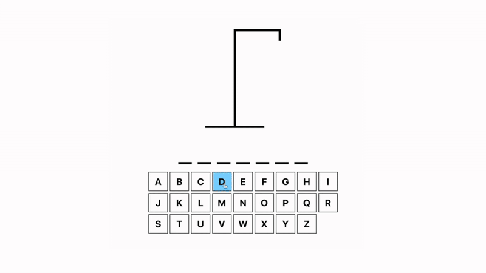

# 🎯 React Pendu

React Pendu est un petit jeu du pendu développé en React avec TypeScript.
Il a pour objectif de mettre en pratique des notions comme la gestion d'état, les composants réactifs et les interactions utilisateur.

Ce projet a été conçu dans un but d'apprentissage personnel de React + Vite, en m'appuyant sur un tutoriel de [Web Dev Simplified](https://www.youtube.com/watch?v=-ONUyenGnWw).

## 📸 Aperçu

> Aperçu de l’interface du jeu avec les lettres cliquables (souris ou clavier), l’affichage du mot à deviner, les essais restants et l'affichage en cas de défaite.



## 🚀 Fonctionnalités

- ✅ Affichage d’un mot aléatoire à deviner
- ✅ Interaction via des boutons représentant les lettres de l’alphabet
- ✅ Mise à jour visuelle à chaque tentative (lettres trouvées ou erreurs)
- ✅ Affichage dynamique du nombre d’erreurs restantes
- ✅ Fin de partie (gagné ou perdu) avec message adapté

## 🛠️ Stack technique

- **Framework** : React +TS
- **Build tool** : Vite
- **Style** : CSS

## 🔧 Installation

```bash
# 1. Clone le dépôt
git clone https://github.com/florianLSP/react-pendu.git

# 2. Installe les dépendances
npm install

# 3. Lance le projet
npm run dev
```
